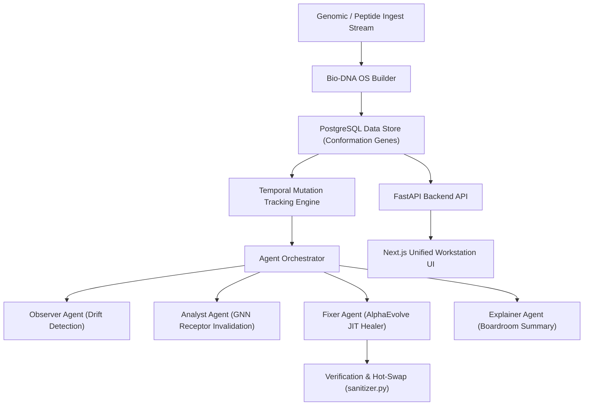

# Bio-DNA 

**Bio-DNA OS** is an advanced, production-grade Data Observability and Lineage Integrity Framework optimized specifically for High-Throughput Proteomic Screening, Computational Drug Discovery, and Nutritional Bioactive Peptide pipelines.

---

## Architecture Overview

Bio-DNA OS provides real-time tracking of dual-track biological data streams, calculates genetic structural variations, and uses an evolutionary JIT script healer to self-heal formatting and alignment crashes dynamically.



---

## Key Framework Features

### 1. Dual-Track Polypharmacological Primitives
Monitors separate parallel biological data pipelines mapping to multiple human target receptors:
*   **Track A (Small-Molecule Neuro-Therapeutics):**
    *   `neuro_fasta_sequences` $\rightarrow$ `neuro_alphafold_structures` $\rightarrow$ `neuro_dopamine_docking_matrix` (Dopamine D2 Receptor).
*   **Track B (Nutritional Bioactive Peptides):**
    *   `peptide_fasta_sequences` $\rightarrow$ `peptide_alphafold_structures` $\rightarrow$ `peptide_cox2_docking_matrix` & `peptide_tnf_docking_matrix` (COX-2 & TNF-alpha receptors).

### 2. Biological Mutation Tracking Engine
*   **Structural Conformation Gene Diffs:** Calculates detailed mutation types (substitutions, deletions, and insertions of amino acid residues) when genetic variations are introduced.
*   **GNN Downstream Invalidation Audit:** Dynamically computes the **Downstream Target Invalidation Scale** (mutations count $\times$ 250 compound candidates) to evaluate drug screening degradation.

### 3. AlphaEvolve JIT Script Healer
*   Generates a self-healing Python hot-patch to repair structural layout and format crashes.
*   Executes automated validation checks using Windows PowerShell.
*   Hot-swaps the operational parser file (`backend/app/services/sanitizer.py`) in the live execution path if verification succeeds.

---

## Quick Start (Local Run)

### 1. Initialize Configuration
Copy the environment template in the project root:
```powershell
Copy-Item -Path ".env.example" -Destination ".env" -Force
```

To run offline using mock LLM fallbacks, keep `LLM_API_KEY` blank. To use a local model, configure `LLM_BASE_URL` to point to your local Ollama instance:
```ini
LLM_BASE_URL=http://localhost:11434/v1
LLM_MODEL=llama3
DATABASE_URL=sqlite:///./dna.db
DEMO_SEED_ENABLED=true
```

### 2. Run the Backend (FastAPI)
```powershell
cd backend
pip install -r requirements.txt
python -m uvicorn app.main:app --host 127.0.0.1 --port 8000
```

### 3. Run the Frontend (Next.js)
```powershell
cd frontend
npm install
npm run dev
```

*   **Workstation Console:** [http://localhost:3000](http://localhost:3000)
*   **FastAPI API Docs:** [http://127.0.0.1:8000/docs](http://127.0.0.1:8000/docs)

---

## Demo Script Testing

Seed the dual-track parallel lineage with active mutations:
```powershell
Invoke-RestMethod -Uri "http://localhost:8000/demo/magic-run" -Method Post
```

Simulate the JIT script healer compilation and hot-swapping sequence:
```powershell
$body = @{
    dataset = "peptide_fasta_sequences"
    issue_type = "sequence_drift"
} | ConvertTo-Json

Invoke-RestMethod -Uri "http://localhost:8000/simulate-fix" -Method Post -Body $body -ContentType "application/json"
```
